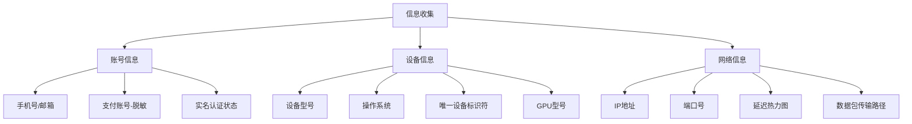
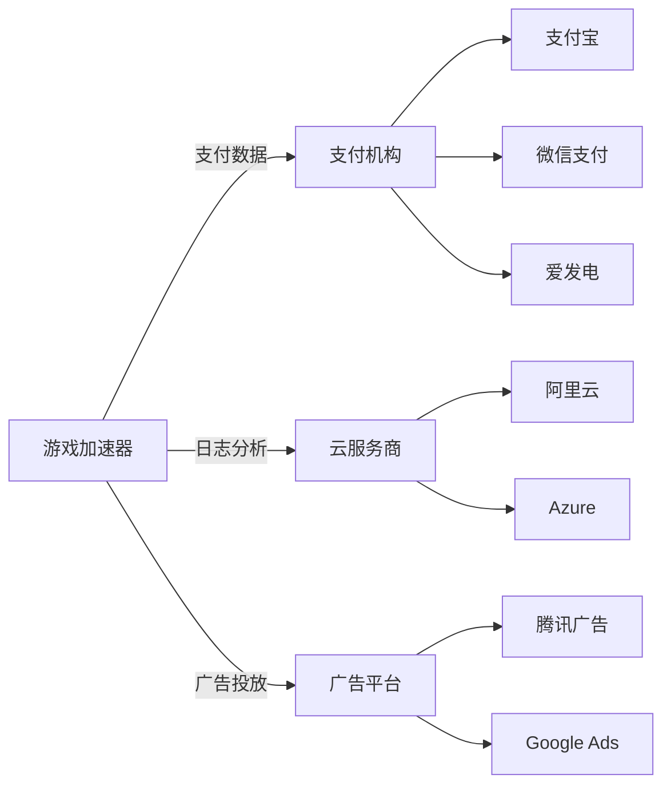
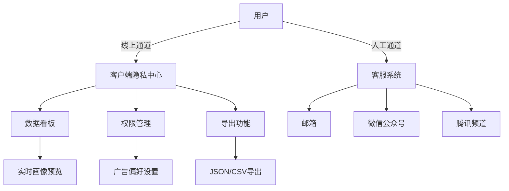
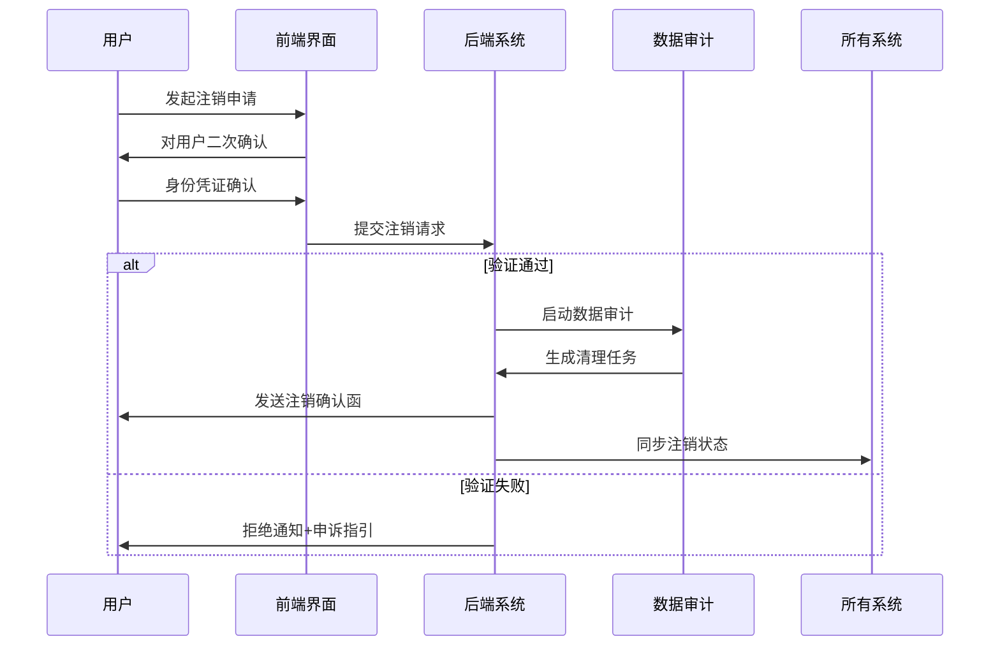
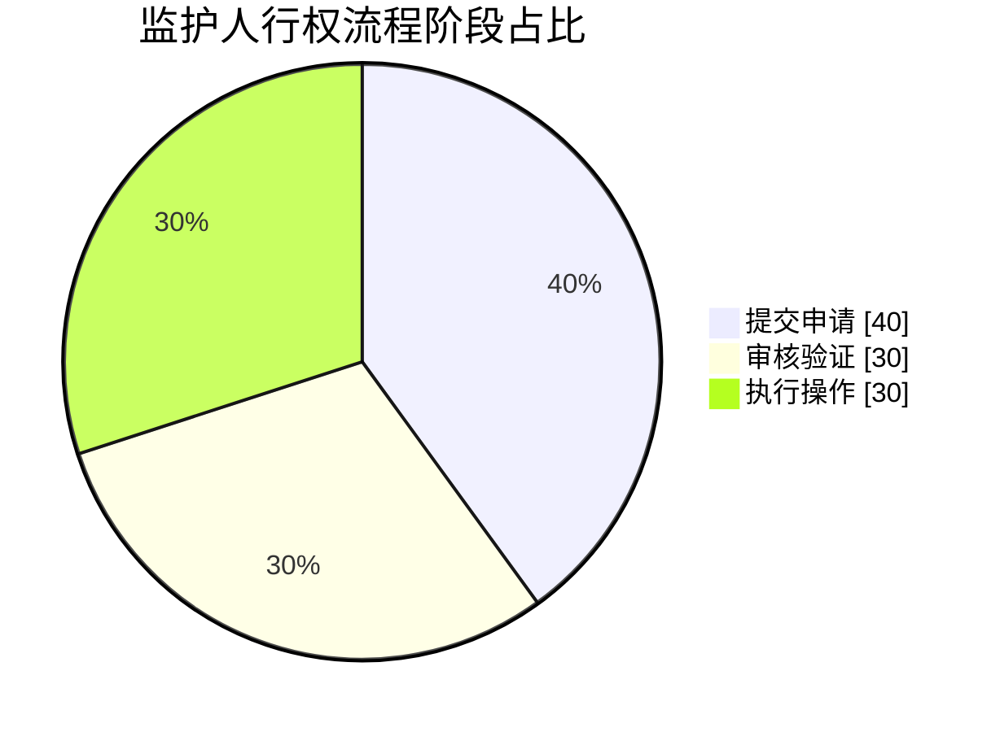
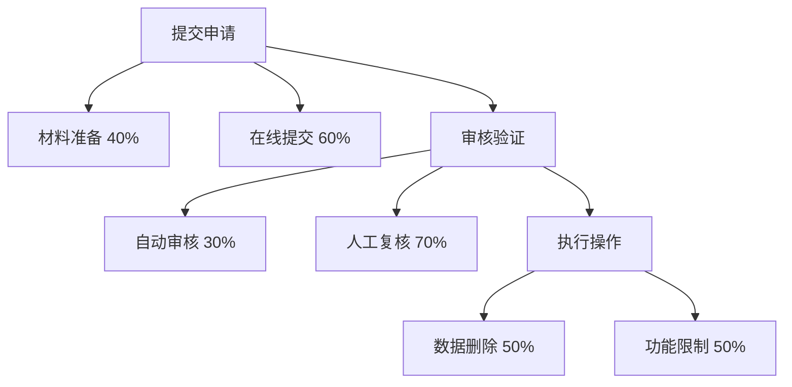
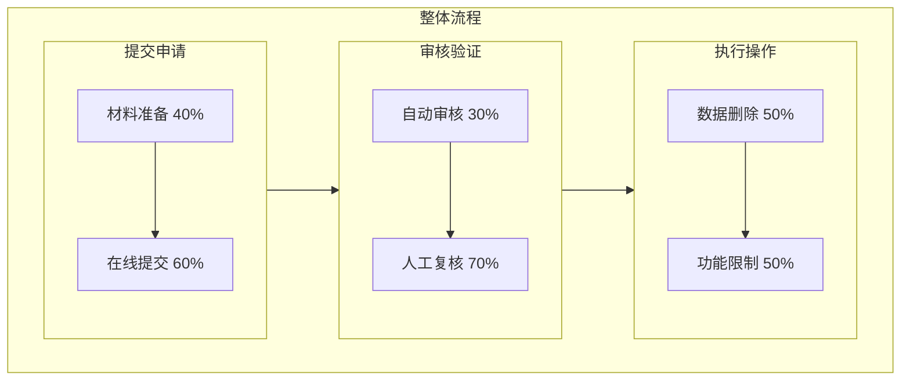
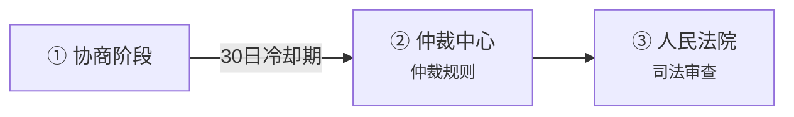
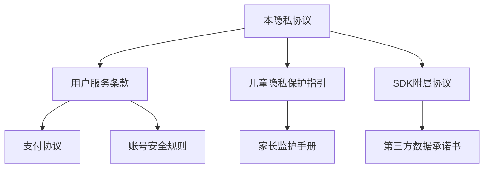

## 慕讯公益加速器隐私协议
**更新日期：2025年5月18日**
**生效日期：2025年6月18日**

---

### 第一章 总则
#### 1.1 制定依据
依据《中华人民共和国个人信息保护法》第13条、《网络安全法》第41条、《数据安全法》第27条及《儿童个人信息网络保护规定》制定，遵循GB/T 35273-2027《信息安全技术 个人信息安全规范》标准。

#### 1.2 适用范围
覆盖以下服务场景：
- 🖥️ 客户端（Windows/macOS/Android/iOS/Linux/HarmonyOS）
- 🌐 官网及子域名（*.mxfree.ao-x.ac.cn）
- ⚙️ API接口服务（api.mxfree.ao-x.ac.cn）
- 💬 社区论坛、客服系统及活动页面
- 🎮 游戏内嵌SDK服务

#### 1.3 协议生效与变更
| 变更类型       | 通知方式                          | 用户操作要求          | 生效缓冲期 |
|----------------|-----------------------------------|-----------------------|------------|
| **重大变更**   | 弹窗提示+短信+邮件+官网横幅       | 需重新勾选同意        | 30日       |
| **功能调整**   | 客户端消息中心+官网公告栏         | 继续使用即视为同意    | 15日       |
| **文字优化**   | 更新日志页面                      | 无需额外确认          | 即时生效   |

---

### 第二章 信息收集
#### 2.1 必要信息收集矩阵


#### 2.2 可选信息收集机制
- **用户画像标签**：
  - 生成算法：`K-means聚类+时间序列分析`
  - 标签示例：
    - `FPS专家 = 射击游戏时长 > 15h/周`
    - `跨区服玩家 = 月均切换节点 > 5次`
- **诊断数据包**：
```json
{
  "network_trace": "路由路径图",
  "packet_loss": "丢包率统计",
  "frame_rate": "帧率波动曲线",
  "cpu_usage": "核心占用率"
}
  ```

#### 2.3 第三方SDK合规清单
| SDK名称              | 所属公司     | 隐私链接                          |
|---------------------|-------------|-----------------------------------|
| **腾讯**             | 腾讯        |[隐私政策](https://privacy.qq.com)|
| **阿里云**           | 阿里巴巴     |[条款](https://terms.aliyun.com)|
| **Clarity**         | Microsoft   |[隐私政策](https://www.microsoft.com/privacy/privacystatement)|
| **DotNet**          | Microsoft   |[隐私政策](https://www.microsoft.com/privacy/privacystatement)|

#### 2.4 绝对禁止收集的敏感信息
 - 🚫 **生物特征**：人脸/声纹/指纹/虹膜
 - 🚫 **健康数据**：心率/睡眠/步数
 - 🚫 **通讯数据**：通讯录/通话记录/短信
 - 🚫 **精确定位**：GPS坐标（除非开启"节点定位"功能）

---

### 第三章 信息使用
#### 3.1 数据处理法律依据表
| 处理目的         | 法律依据            | 数据类型            | 技术措施                  |
|------------------|---------------------|---------------------|---------------------------|
| 加速服务         | 履行合同(第13条)    | IP+设备ID           | TLS 1.3加密传输           |
| 反作弊系统       | 法定义务(第27条)    | 登录行为模式        | 实时风控引擎分析          |
| 个性化推荐       | 单独授权(第15条)    | 游戏偏好标签        | 差分隐私保护算法          |
| 故障诊断         | 用户主动同意        | 诊断数据包          | 数据脱敏处理              |

#### 3.2 第三方数据共享拓扑


#### 3.3 数据生命周期管理
| 数据类型       | 存储期限       | 存储位置       | 删除机制                     |
|----------------|----------------|----------------|------------------------------|
| 账号信息       | 注销后6个月    | 北京数据中心   | SHA-256覆盖写入              |
| 网络日志       | 12个月         | 西安数据中心   | 定时清理任务                 |
| 交易记录       | 3年            | 北京备份中心   | 只读存储不可修改             |
| 诊断数据       | 30天           | 用户本地设备   | 自动清理                     |

---

### 第四章 用户权利
#### 4.1 权利实现路径图


#### 4.2 账户注销全流程


---

### 第五章 数据安全
#### 5.1 安全防御体系架构
**加密协议栈**：
```plaintext
应用层：JWT令牌认证
传输层：TLS 1.3 + ECDHE-ECDSA-AES256-GCM-SHA384
存储层：SM4国密算法 + HSM硬件加密机
备份层：AES-256 + 异地容灾（3副本分散存储）
```

**访问控制模型**：
- 🔐 RBAC三级权限体系（员工/管理员/审计员）
- 🛡️ 特权账号双因素认证（2FA+系统识别）
- 📜 操作日志留存策略：
  - 普通操作：2年
  - 敏感操作：永久存档

#### 5.2 数据泄露应急响应
| 事件等级 | 判定标准                | 响应动作                          | 时限   |
|----------|-------------------------|-----------------------------------|--------|
| Ⅰ级      | 影响＞1万人             | 网信部门报告+全员通知+媒体公告    | ≤48h   |
| Ⅱ级      | 影响≤1万人             | 受影响用户通知+漏洞修复报告        | ≤72h   |
| Ⅲ级      | 内部高危漏洞            | 渗透测试+系统加固+白帽子奖励       | ≤7天  |

---

### 第六章 跨境传输
#### 6.1 跨境传输合规框架
✅ **中国合规**：
{/*- 网信办安全评估（备案号：GDPS-[2025]XXX）
- 签订《数据出境安全承诺书》*/}

✅ **国际合规**：
{/*- 欧盟SCC标准合同条款
- APEC跨境隐私规则体系*/}

#### 6.2 用户控制面板选项
| 选项               | 数据流向                     | 功能影响                     |
|--------------------|------------------------------|------------------------------|
| 允许出境           | 全球节点优化                 | 外服游戏延迟降低60%以上     |
| 仅限中国大陆       | 境内专属服务器               | 无法连接国际节点             |
| 自定义区域         | 指定区域（如亚太/欧美）      | 平衡速度与隐私需求           |

---

### 第七章 未成年人保护
#### 7.1 青少年防护体系
| 防护维度       | 14岁以下                    | 14-18岁                      |
|----------------|-----------------------------|------------------------------|
| **支付控制**   | ❌ 完全禁用                  | ⚠️ 单笔≤100元/日≤500元        |
| **广告策略**   | ❌ 无广告                    | ⚠️ 仅教育类广告               |
| **社交功能**   | ❌ 禁用所有互动              | ⚠️ 关键词过滤+人工审核        |
| **游戏时长**   | ⏰ 22：00-8：00强制下线      | ⏰ 每日≤3小时                 |

#### 7.2 监护人权利实现路径
##### 整体时间/资源占比

##### 每个阶段的子步骤占比

##### 完整流程关系


---

### 第八章 其他条款
#### 8.1 责任豁免情形
⚠️ **用户自身原因**：
- 公开分享的数据（论坛发帖/评论）
- 主动告知第三方的账户信息

⚠️ **不可抗力事件**：
- 自然灾害（地震/洪水）
- 国家级网络攻击
- 政府强制管控措施

#### 8.2 争议解决机制


#### 8.3 协议体系关联图
